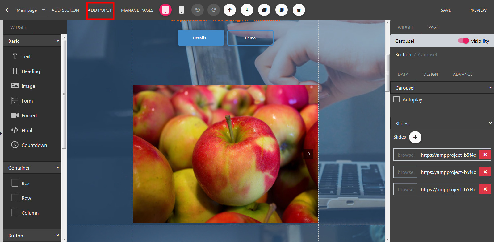

Popup
==============

==============
Adding a Popup
==============

- Open the Builder, click Add Popup button located on left side of the header.

- Next, select your prefer popup type:
	- Sidebar: show from left or right side of the browser.
	- Notification: show when user visits this page.
	- Lightbox: show when user clicked a button.

==============
Edit a Popup
==============

- Still in the builder, click the Page Tabs dropdown located on the header
- Select a popup on the menu dropdown.

.. image:: ../assets/images/editpopup.jpg

==============
Section Properties
==============
**Offset**

Change height of the section.
**Border**

Set border color, stroke and add a corner radius.
**Box shadow**

Add shadow to your section.
**Label Properties**

Set text properties such as color, font style. It will apply for every new text widget added to this section.
**Background**

Set background color, image. Support gradient color.
